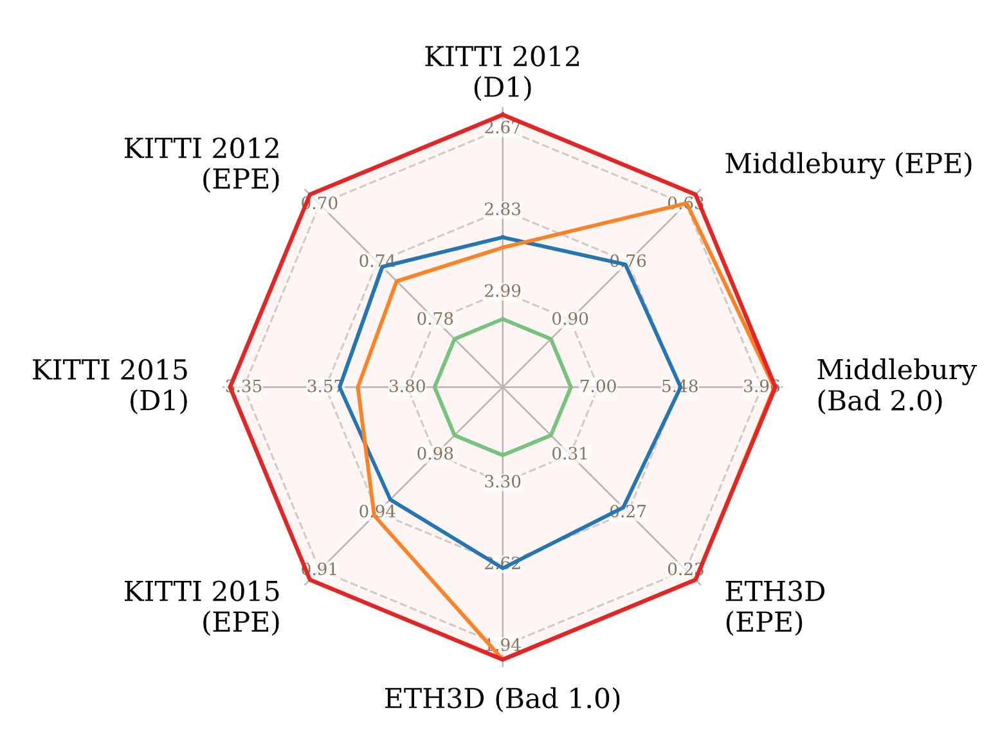

<h1 align="center">Lite Any Stereo (LAS) Series</h1>

<p align="center">
  <a href="https://arxiv.org/abs/2511.16555" target="_blank" rel="external nofollow noopener">
  </a>
  <a href="https://tomtomtommi.github.io/LiteAnyStereo/"></a>
  <a href="https://tomtomtommi.github.io/LiteAnyStereoV2/"></a>
</p>

<p align="center">
  <strong>Official codebase for the Lite Any Stereo (LAS) series.</strong><br>
  LAS1 code is available now. LAS2 paper and code are coming soon.
</p>

## Overview

**Lite Any Stereo (LAS)** is a series of efficient zero-shot stereo matching models for practical deployment.

This repository serves as the shared codebase for the LAS series. It currently contains the released code, checkpoints, demos, and evaluation scripts for **Lite Any Stereo (LAS1)**. The upcoming **Lite Any Stereo V2 (LAS2)** paper and code will also be released here.

## LAS Series

| Version | Title | Resources | Status |
| --- | --- | --- | --- |
| LAS1 | Lite Any Stereo: Efficient Zero-Shot Stereo Matching | [Paper](https://arxiv.org/abs/2511.16555), [Project page](https://tomtomtommi.github.io/LiteAnyStereo/) | CVPR 2026 |
| LAS2 | Lite Any Stereo V2: Faster and Stronger Efficient Zero-Shot Stereo Matching | [Project page](https://tomtomtommi.github.io/LiteAnyStereoV2/) | coming soon |

## Performance Snapshot

<p align="center">
  
</p>

<p align="center">
  <em>Zero-shot performance and runtime comparison. Runtime is reported on H200 / Orin.</em>
</p>

## Released Code: LAS1

Lite Any Stereo (LAS1) is a highly efficient stereo matching model with strong zero-shot generalization ability. It outperforms or matches accuracy-oriented models that do not use foundation priors, while requiring less than 1% of their computational cost.

The instructions below are for the currently released LAS1 code.

### Demo
Several example stereo image pairs are provided in the `/assets/` directory. 

You can visualize zero-shot stereo matching results on real-world scenes by running:
```
python demo.py
```
You can also test the model on your own stereo image pairs by replacing the input images.

### Checkpoint
Before running the demo, please download the pretrained checkpoints from [Google Drive](https://drive.google.com/drive/folders/1UvDx296pVk7pC2rozKIpQF_EXcOleZOB?usp=sharing).
Then place them in: `./checkpoints/`

### Benchmark Results
To reproduce the benchmark results reported in Table 3 and Table 4 of the paper, run:
```
sh evaluate.sh
```
The results of [Lite-CREStereo++](https://github.com/TomTomTommi/LiteCREStereo_plusplus) can be reproduced here.

### MACs
To compute the model complexity (MACs), use:
```
python flops_count.py
```

### Runtime
To measure the inference time, run:
```
python profile_speed.py
```
This script uses CUDA synchronization for more accurate latency measurement.
The initial version followed the evaluation practice of previous methods and reported runtime using `evaluate_stereo.py`

## Citation
If you find the released code useful, please consider citing:
```
@InProceedings{Jing_2026_CVPR,
    author    = {Jing, Junpeng and Luo, Weixun and Mao, Ye and Mikolajczyk, Krystian},
    title     = {Lite Any Stereo: Efficient Zero-Shot Stereo Matching},
    booktitle = {Proceedings of the IEEE/CVF Conference on Computer Vision and Pattern Recognition (CVPR)},
    month     = {June},
    year      = {2026},
    pages     = {21725-21735}
}
```

The LAS2 citation will be added when the paper is available.
